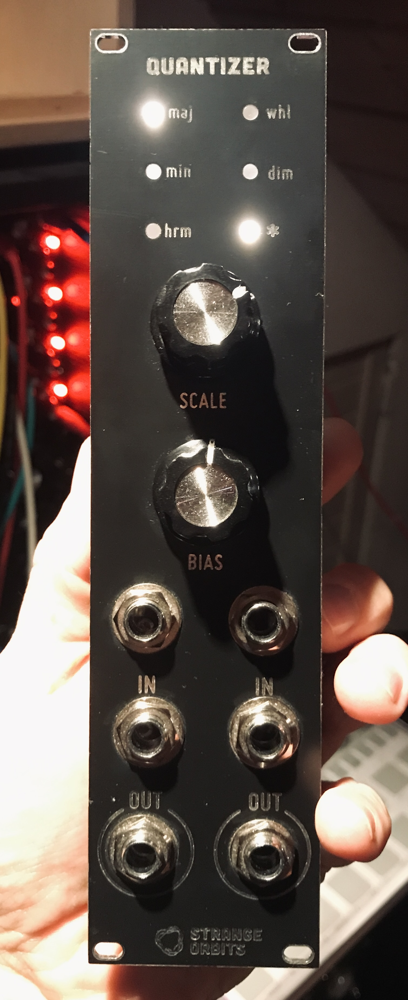

Kosmo format quantizer based largely on the [kassutronics quantizer](https://store.kassutronics.net/eurorack-diy-c-1/quantizer-p-1). 
I went for a different interface though, where you select the scale via potentiometer and with the second potentiometer (and cv input) you can bias the incoming voltages and therefore 'transpose in scale'. 
It still lacks a few scales.

 

